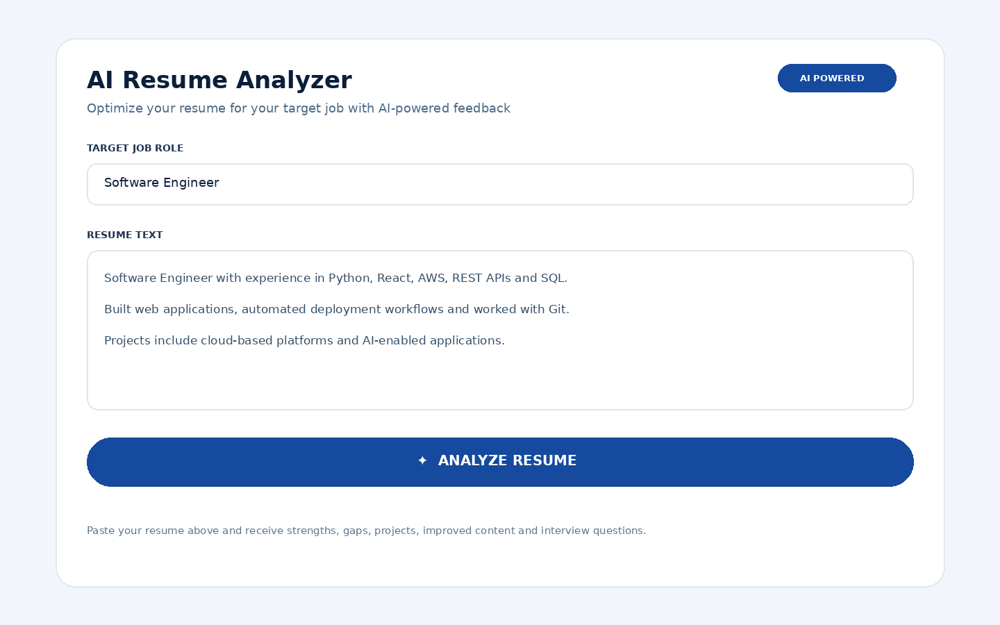
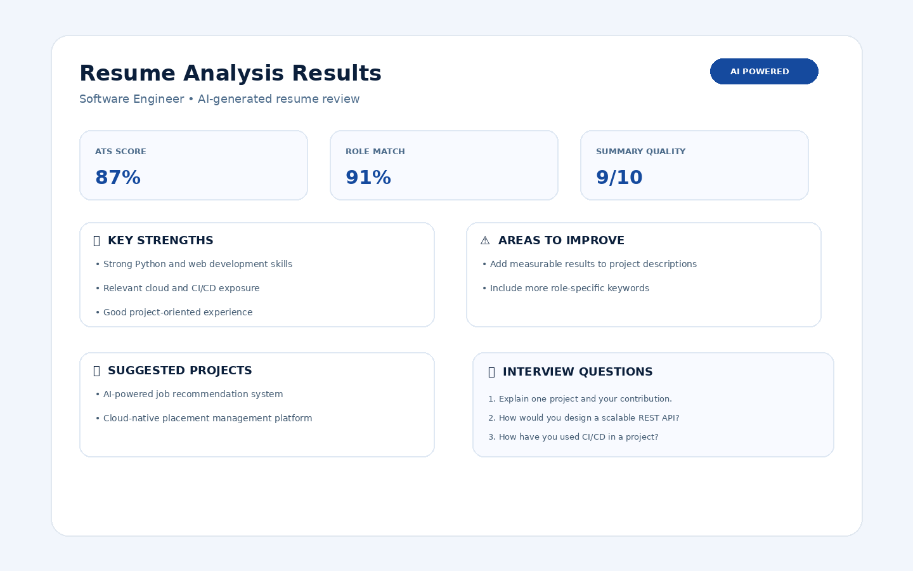
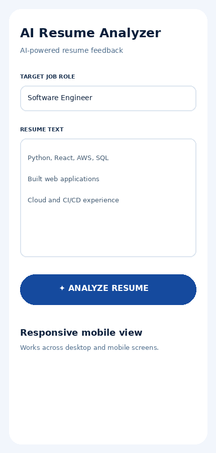

# AI Resume Analyzer

An AI-powered resume analyzer that evaluates a resume against a target job role and provides practical feedback, an improved resume version, project suggestions, and interview questions.

## Features

- Target job role input
- Resume text analysis
- Resume Summary Quality score
- Job Role Match Score
- Key strengths
- Weak areas and improvement suggestions
- Suggested projects
- AI-improved resume version
- Top 10 interview questions
- Simple web frontend
- Flask REST API backend
- OpenRouter AI integration

## Screenshots

### Home Page


### Analysis Results


### Mobile View


## Project Structure

```text
resume-analyzer/
├── index.html           # Frontend UI
├── resume_api.py        # Flask backend/API
├── requirements.txt     # Python dependencies
├── .env.example         # Environment-variable template
├── .gitignore           # Files excluded from Git
├── screenshots/         # Project UI screenshots
│   ├── 01-home-page.png
│   ├── 02-analysis-results.png
│   └── 03-mobile-view.png
└── README.md            # Project documentation
```

## Technologies

- HTML, CSS, JavaScript
- Python
- Flask
- Flask-CORS
- OpenAI Python SDK
- OpenRouter API

## How the application works

```text
User enters job role + resume
          ↓
Frontend sends POST /analyze
          ↓
Flask backend validates the request
          ↓
Backend sends the prompt to OpenRouter
          ↓
AI analyzes the resume
          ↓
Backend returns the result as JSON
          ↓
Frontend displays the analysis
```

## Run Locally

### 1. Clone the repository

```bash
git clone <your-repository-url>
cd resume-analyzer
```

### 2. Create a virtual environment

Windows PowerShell:

```powershell
python -m venv .venv
.\.venv\Scripts\Activate.ps1
```

Windows Command Prompt:

```cmd
python -m venv .venv
.venv\Scripts\activate
```

### 3. Install dependencies

```bash
pip install -r requirements.txt
```

### 4. Configure the API key

Copy `.env.example` to `.env` and replace the placeholder with your OpenRouter API key:

```text
OPENROUTER_API_KEY=your_real_api_key
```

**Do not upload `.env` or your real API key to GitHub.**

### 5. Start the backend

```bash
python resume_api.py
```

The API runs at:

```text
http://localhost:8000
```

### 6. Open the frontend

Open `index.html` in your browser while the backend is running.

The frontend sends requests to:

```text
http://localhost:8000/analyze
```

## API

### POST `/analyze`

Request body:

```json
{
  "resume": "Resume text here",
  "role": "Software Engineer"
}
```

Successful response:

```json
{
  "result": "AI-generated resume analysis..."
}
```

## Important Security Note

The OpenRouter API key is used only by the Flask backend. Keep it in `.env` and never hard-code it in `index.html`, `resume_api.py`, or commit it to GitHub.

## Deployment Note

This repository is ready for GitHub and local demonstration. For a public live website, deploy the Flask backend to a server/hosting platform and change the frontend API URL from `http://localhost:8000/analyze` to your deployed backend URL. Do not expose the OpenRouter API key in frontend JavaScript.

## Future Improvements

- PDF/DOCX resume upload and text extraction
- ATS keyword visualization
- Skill-gap analysis
- Resume analysis history
- Download improved resume as PDF
- User authentication
- Production deployment

## Disclaimer

AI-generated recommendations are suggestions. Users should verify all resume content and ensure that the improved resume contains only truthful information.
